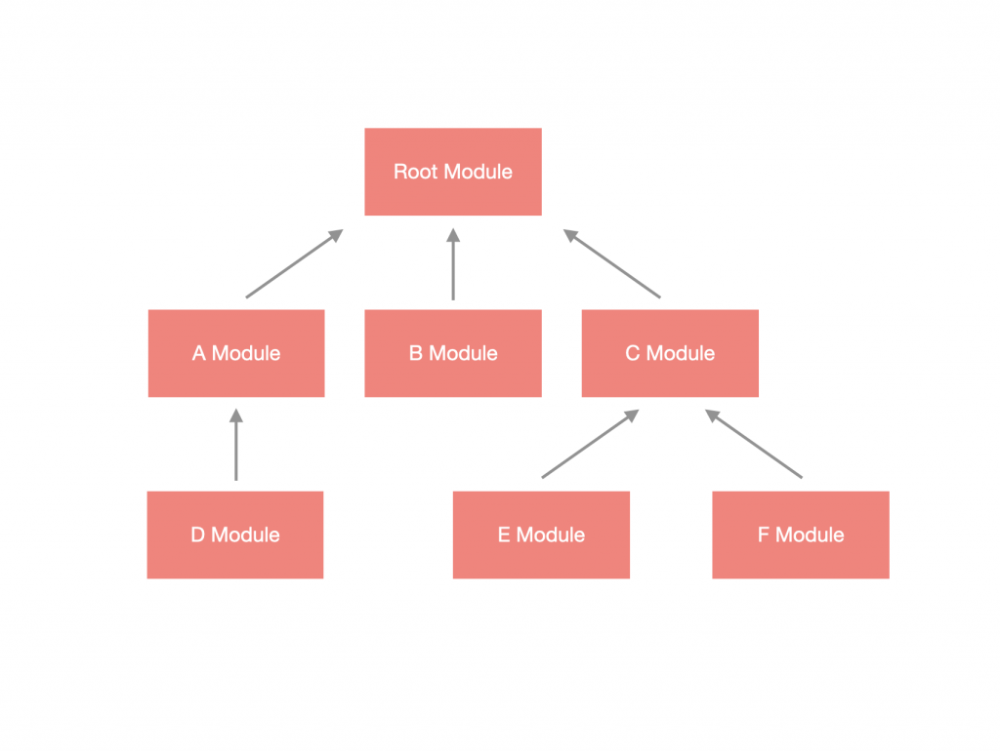
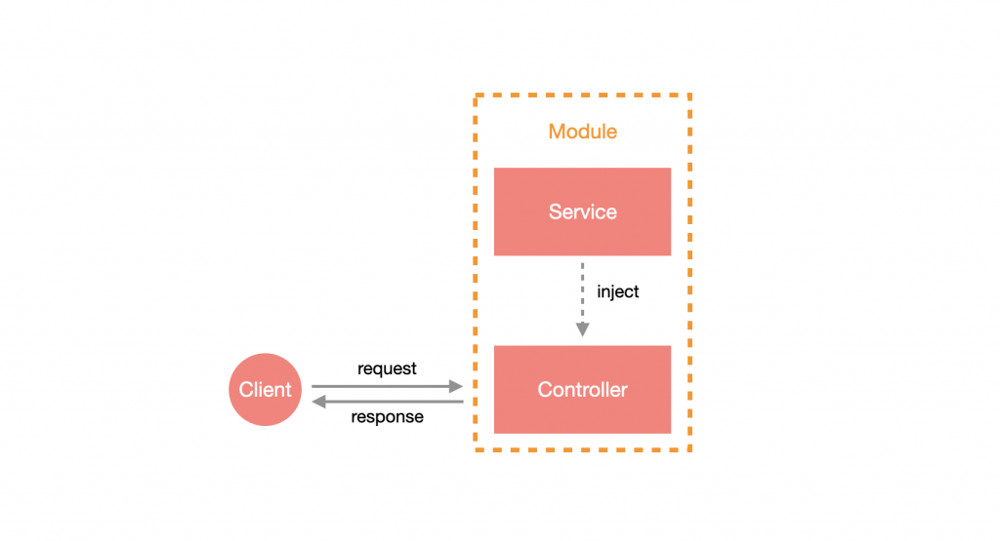

# NestJS

node^18.15.0

傳送門：

- [Controller](./tutorial/CONTROLLER.md)
- [Module](./tutorial/MODULE.md)
- [Provider](./tutorial/PROVIDER.md)
- [Exception & Excrption Filter](./tutorial/EXCEPTION.md)
- [Pipe](./tutorial/PIPE.md)
- [Middleware](./tutorial/MIDDLEWARE.md)
- [Interceptor](./tutorial/INTERCEPTOR.md)
- [Guard](./tutorial/GUARD.md)
- [Decorator](./tutorial/DDECORATOR.md)
- [Dynamic Module](./tutorial/DYNAMICMODULE.md)
- [ConfigModule](./tutorial/CONFIGMODULE.md)
- [Scope](./tutorial/SCOPE.md)
- [Lifecycle Hooks](./tutorial/LIFECYCLEKOOKS.md)
- [Module Reference](./tutorial/MODULEREFERENCE.md)
- [File Upload](./tutorial/FILEUPLOAD.md)
- [HttpModule](./tutorial/HTTPMODULE.md)
- [MongoDB](./tutorial/MONGODB.md)
- [Authentication](./tutorial/AUTHENTICATION.md)

## 基本概念

Nest 採用模組化設計，將各個不同的功能區塊打包成 **模組 (Module)**，而 Module 必定有 **一個以上**，並且是以 **樹狀結構** 發散出去，最頂部的 Module 稱為 **根模組 (Root Module)**。



一個 **有路由機制** 的 Module 會帶有 **控制器 (Controller)** 與 **服務 (Service)**。



Controller 與 Service 透過 Module 建立關係後，即可將 Service **注入 (Inject)** 到 Controller 中使用，這樣的好處是可以職責分離，把處理請求的操作交給 Controller，把處理邏輯的部分交給 Service。

## 安裝

用 `npm` 將 NestCLI 全域安裝，之後就能在 terminal 使用 `nest` 指令。

```bash
npm install -g @nestjs/cli
```

查看可使用指令：

```bash
nest --help
```

## 建置 App

透過 NestCLI 指令快速建置：

```bash
nest new <APP_NAME>
```

跑完程序後，執行 App：

```bash
cd <APP_NAME>
npm start
```

Nest 預設會在 :3000

```url
http://localhost:3000
```

## 資料夾結構

```text
|- dist
|- node_modules
|- src
|  |- app.controller.ts
|  |- app.controller.spec.ts
|  |- app.module.ts
|  |- app.service.ts
|  |- main.ts
|- test
|  |- app.e2e-spec.ts
|  |- jest-e2e.json
|- .eslintrc.js
|- .gitignore
|- .prettierrc
|- nest-cli.json
|- package.json
|- package-lock.json
|- tsconfig.json
|- tsconfig.build.json
|- README.md
```

- **dist**：ts 編譯完後產生的 js 會放這。
- **node_modules**：依賴套件們。
- **src**：專案程式碼。
- **test**：測試用。
- **.eslintrc.js**：ESLint 設定檔。
- **.gitignore**：設定排除版控檔案。
- **.prettierrc**：Prettier 設定檔。
- **nest-cli.json**：NestCLI 設定檔。
- **package.json**：紀錄專案資訊。
- **package-lock.json**：紀錄套件版本號。
- **tsconfig.json**：ts 設定檔。
- **tsconfig.build.json**：ts 編譯設定檔，為上點延伸。

### src

- **main.ts 入口點**：

  ```ts
  import { NestFactory } from '@nestjs/core';
  import { AppModule } from './app.module';

  async function bootstrap() {
    const app = await NestFactory.create(AppModule);
    await app.listen(3000);
  }
  bootstrap();
  ```

  以非同步的 `bootstrap` 函式做為載入函式，透過 `NestFactory.create(AppModule)` 產生一個 Nest App 的實例 (Instance)，並透過呼叫該實例的 listen(PORT) 將其架設起來。

- **app.module.ts 根模組**：

  ```ts
  import { Module } from '@nestjs/common';
  import { AppController } from './app.controller';
  import { AppService } from './app.service';

  @Module({
    imports: [],
    controllers: [AppController],
    providers: [AppService],
  })
  export class AppModule {}
  ```

  在 Nest 中，大部分的元件都是使用 **裝飾器 (Decorator)** 的方式來提供 **元數據 (Metadata)**，可以看到定義了一個名為 `AppModule` 的 `class`，透過裝飾器將其變成 Nest 的 Module，並在這裡定義該模組的 Controller 與 Service。

  - **app.controller.ts 控制器**：

    ```ts
    import { Controller, Get } from '@nestjs/common';
    import { AppService } from './app.service';

    @Controller()
    export class AppController {
      constructor(private readonly appService: AppService) {}

      @Get()
      getHello(): string {
        return this.appService.getHello();
      }
    }
    ```

    **控制器**不是必要項目，可以看到它也是使用帶有裝飾器的 `class`，比較特別的是裡面的方法 (Method) 也使用了裝飾器，來定義該方法是使用哪種方式進行觸發等。另外，可以在 `constructor` 中看見 `appService` 的參數，這是使用 **依賴注入(Dependency Injection)** 的方式將 `AppService` 注入到 `AppController` 中。

  - **app.service.ts 服務**：

    ```ts
    import { Injectable } from '@nestjs/common';

    @Injectable()
    export class AppService {
      getHello(): string {
        return 'Hello World!';
      }
    }
    ```

    **服務**不是必要項目，與 Module、Controller 有些不同，Service 所使用的裝飾器為 `Injectable`，原因是 Service 屬於 **抽象** 的概念，在 Nest 中有許多抽象概念可以使用 Injectable 來實作，他們統一歸類為 **Provider**。

## Hot Reload 熱更新

### Installation

```bash
npm i --save-dev webpack-node-externals run-script-webpack-plugin webpack
```

### Configuration

根目錄下新增一個 `webpack-hmr.config.js`：

```js
const nodeExternals = require('webpack-node-externals');
const { RunScriptWebpackPlugin } = require('run-script-webpack-plugin');

module.exports = function (options, webpack) {
  return {
    ...options,
    entry: ['webpack/hot/poll?100', options.entry],
    externals: [
      nodeExternals({
        allowlist: ['webpack/hot/poll?100'],
      }),
    ],
    plugins: [
      ...options.plugins,
      new webpack.HotModuleReplacementPlugin(),
      new webpack.WatchIgnorePlugin({
        paths: [/\.js$/, /\.d\.ts$/],
      }),
      new RunScriptWebpackPlugin({ name: options.output.filename, autoRestart: false }),
    ],
  };
};
```

記得在 `.eslintrc` 將 `webpack-hmr.config.js` 排除在 ESLint 規則外。

### Hot-Module Replacement (HMR)

要啟動 **HMR**，`main.ts` 要加上 webpack 相關指示：

```ts
declare const module: any;

async function bootstrap() {
  const app = await NestFactory.create(AppModule);
  await app.listen(3000);

  if (module.hot) {
    module.hot.accept();
    module.hot.dispose(() => app.close());
  }
}
bootstrap();
```

更新 `package.json` 內的腳本：

```text
"start:dev": "nest build --webpack --webpackPath webpack-hmr.config.js --watch"
```
