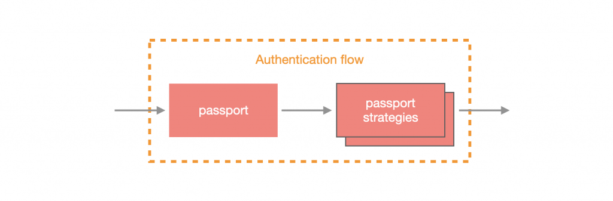
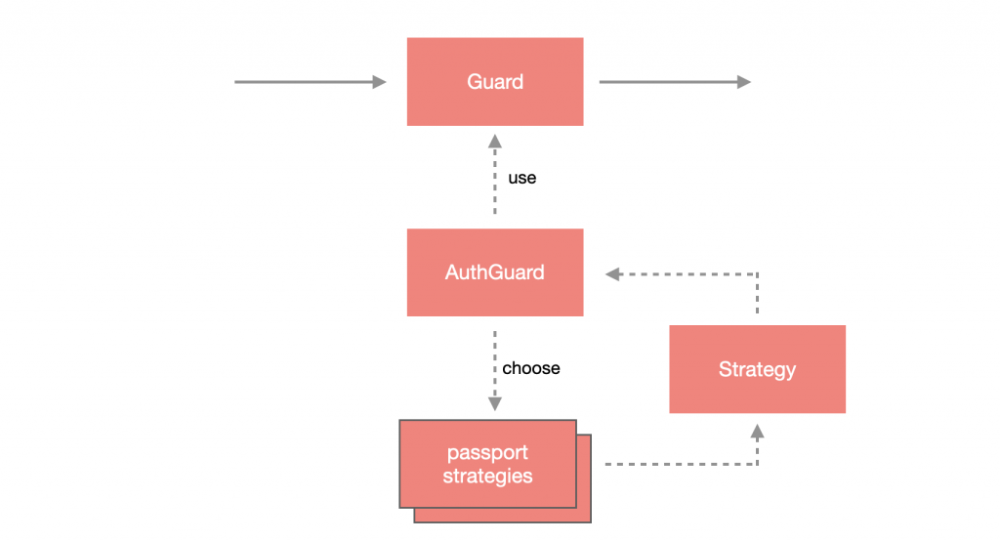
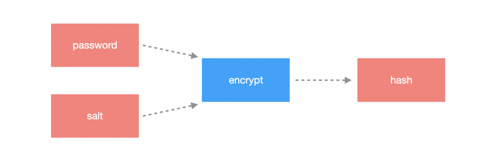

# Authentication

一個應用程式可能會有非常多種的註冊方式，每一種方式都有一套自己的 **策略(Strategy)**，所以管理各種 **帳戶驗證(Authentication)** 的策略也是非常重要。

node.js 圈子中，最熱門的帳戶驗證管理工具 [Passport.js](http://www.passportjs.org/) (簡稱：`passport`)，Nest 也有將其包裝成模組，名稱為 `PassportModule`。

## passport 介紹

`passport` 採用了 **策略模式** 來管理各種驗證方式，它主要由兩個部分構成整個帳戶驗證程序，分別為：`passport` 與 `passport strategy`。

`passport` 本身是用來處理 **驗證流程** 的，而 `passport strategy` 則是 **驗證機制**，兩者缺一不可，整個 `passport` 生態系有上百種的驗證機制讓開發人員使用，如：facebook 驗證策略、google 驗證策略、本地驗證策略等，完美解決各種驗證機制的處理。



在 Nest 中，`passport strategy` 會與 Guard 進行搭配，透過 `AuthGuard` 將 `strategy` 包裝起來，就可以透過 Nest 的 Guard 機制來與 `passport` 做完美的搭配。



## 安裝 passport

透過 `npm` 來安裝 `passport`，需要安裝 Nest 包裝的模組以及 `passport` 本身：

```text
npm install @nestjs/passport passport
```

## 實作帳戶註冊

開始實作之前，需要先設計一個帳戶註冊的 API。

### 定義 Schema

將使用者的 `Schema`、`Document`、`Schema` 實體，與 `ModelDefinition` 做定義：

```ts
import { ModelDefinition, Prop, raw, Schema, SchemaFactory } from '@nestjs/mongoose';
import { Document } from 'mongoose';

export type UserDocument = User & Document;

@Schema()
export class User {

  @Prop({
    required: true,
    minlength: 6,
    maxlength: 16
  })
  username: string;
  
  @Prop({
    required: true
  })
  email: string;

  @Prop({
    type: raw({
      hash: String,
      salt: String
    }),
    required: true
  })
  password: Record<string, any>;
}

export const UserSchema = SchemaFactory.createForClass(User);

export const USER_MODEL_TOKEN = User.name;

export const UserDefinition: ModelDefinition = {
  name: USER_MODEL_TOKEN,
  schema: UserSchema,
};
```

共設計了三個欄位，分別為：`username`、`email` 與 `password`，其中，`password` 為巢狀結構，原因是我們不希望密碼直接儲存在資料庫裡面，而是透過密碼學中的**加鹽**來替密碼進行加密。

### 鹽加密



鹽加密的概念是將 **輸入值(input)** 與 **某個特定的值(salt)** 進行加密，最後會得出一個 **結果(hash)**。

在 `src/core/utils` 下新增一個 `common.utility.ts` 檔案，並設計一個靜態方法 `encryptBySalt`，它有兩個參數：`input` 與 `salt`，其中，`salt` 的預設值為 `randomBytes` 計算出來的值，而 `input` 與 `salt` 透過 `pbkdf2Sync` 進行 SHA-256 加密並迭代 1000 次，最終返回 `hash` 與 `salt`：

```ts
import { randomBytes, pbkdf2Sync } from 'crypto';

export class CommonUtility {
  public static encryptBySalt(
    input: string,
    salt = randomBytes(16).toString('hex'),
  ) {
    const hash = pbkdf2Sync(input, salt, 1000, 64, 'sha256').toString('hex');
    return { hash, salt };
  }
}
```

### 模組設計

這邊會需要建立兩個模組：`UserModule` 與 `AuthModule`，`UserModule` 是用來處理與使用者相關的操作，而 `AuthModule` 則是處理與身分驗證有關的操作，基本上 `AuthModule` 必定與 `UserModule` 產生依賴，因為要有使用者才有辦法做身分驗證。

#### 使用者模組

`UserModule` 因為要對使用者資料進行操作，需要使用 `MongooseModule` 來建立 `model`，又因為 `AuthModule` 會依賴於 `UserModule` 去操作使用者資料，故我們要將 `UserService` 匯出讓 `AuthModule` 可以透過 `UserService` 去操作使用者資料：

```ts
// ...
import { MongooseModule } from '@nestjs/mongoose';
import { UserDefinition } from '../../common/models/user.model';

@Module({
  imports: [MongooseModule.forFeature([UserDefinition])],
  providers: [UserService],
  exports: [UserService],
})
export class UserModule {}
```

設計一個 DTO 來給定參數型別與進行簡單的資料驗證，新增 `create-user.dto.ts`：

```ts
export class CreateUserDto {
  @MinLength(6)
  @MaxLength(16)
  public readonly username: string;

  @MinLength(8)
  @MaxLength(20)
  public readonly password: string;

  @IsNotEmpty()
  public readonly email: string;
}
```

在 `AppModule` 透過依賴注入的方式來啟用 `ValidationPipe`：

```ts
// ...
import { APP_PIPE } from '@nestjs/core';
import { Module, ValidationPipe } from '@nestjs/common';
import { MongooseModule } from '@nestjs/mongoose';

@Module({
  imports: [
    ConfigModule.forRoot({
      load: [MongoConfigFactory],
      isGlobal: true
    }),
    MongooseModule.forRootAsync({
      imports: [ConfigModule],
      inject: [ConfigService],
      useFactory: (config: ConfigService) => ({
        uri: config.get<string>('mongo.uri'),
      }),
    }),
    UserModule,
    AuthModule,
  ],
  controllers: [AppController],
  providers: [
    AppService,
    { // 注入全域 Pipe
      provide: APP_PIPE,
      useClass: ValidationPipe,
    },
  ],
})
export class AppModule {}
```
