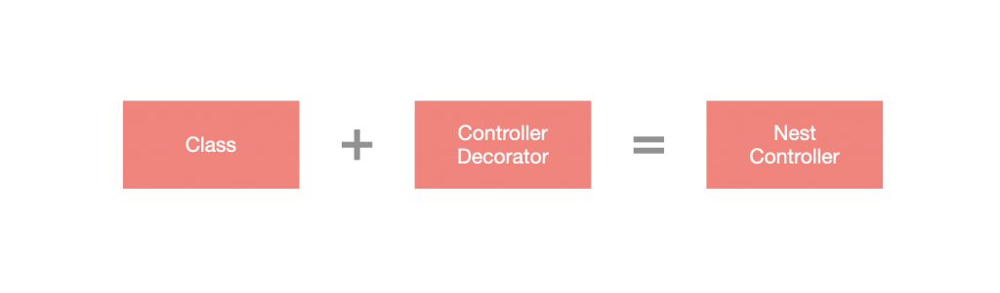

# Decorator

**裝飾器 (Decorator)** 是一種設計模式，有些程式語言會直接將此設計模式實作出來，TS 與 JS 在近年也添加了此功能，而 Nest 將裝飾器發揮到淋漓盡致，透過裝飾器就可以很輕易地套用功能，不論是針對開發速度、易讀性等都很有幫助。



## Custom Decorator

Nest 提供了 **自訂裝飾器 (Custom Decorator)** 的功能，其分成下方三種：

1. 參數裝飾器
2. metadata 裝飾器
3. 合併裝飾器

### 參數裝飾器

有些資料可能無法透過內建裝飾器直接取得，必須透過 `@Request` 裝飾器先取得請求物件，再從請求物件中提取，這樣的方式並不是特別理想，於是可以自行設計參數裝飾器來取得，而 Decorator 可以透過 CLI 產生：

```bash
nest generate decorator <DECORATOR_NAME>
```

建立出來的裝飾器是一個回傳 `SetMetadata` 的函式：

```ts
import { SetMetadata } from '@nestjs/common';

export const User = (...args: string[]) => SetMetadata('user', args);
```

不過參數裝飾器並不是使用 `SetMetadata`，而是透過 `createParamDecorator` 來產生參數裝飾器，並使用 Callback 裡面的 `ExecutionContext` 來取得請求物件再從中取得要取出的資料。

如果想要像 `@Param('id')` 一樣只取出特定資料，可以運用 `createParamDecorator` 中 Callback 的 `data` 參數，這個 `data` 就是帶到裝飾器中的參數。

下方為修改後的 `user.decorator.ts`：

```ts
import { createParamDecorator, ExecutionContext } from '@nestjs/common';

export const User = createParamDecorator(
  /**
   * @param {any} data - 從 `@User(data)` 傳入裝飾器的參數
   * @param {ExecutionContext} ctx - 描述當前請求處理流程(或請求管道 request pipeline)的介面
   */
  (data: string, ctx: ExecutionContext) => {
    const request = ctx.switchToHttp().getRequest();
    const user = request.user;
    return data ? user[data] : user;
  },
);
```

透過 CLI 產生 `AddUserMiddleware`：

```ts
@Injectable()
export class AddUserMiddleware implements NestMiddleware {
  use(req: any, res: any, next: () => void) {
    req.user = { name: 'VIC' };
    next();
  }
}
```

接著，在 `AppModule` 中套用 `AddUserMiddleware`，修改 `app.module.ts` 如下：

```ts
@Module({
  imports: [],
  controllers: [AppController],
  providers: [AppService]
})
export class AppModule implements NestModule {
  configure(consumer: MiddlewareConsumer) {
    consumer.apply(AddUserMiddleware).forRoutes('');
  }
}
```

最後在 Controller 中，將 `@User` 裝飾器放置在請求參數的位置，就能將 `user` 內容取出並返回給客戶端：

```ts
@Controller()
export class AppController {
  constructor() {}

  @Get()
  getHello(@User() user: any): string {
    return user;
  }


  @Get('name')
  getName(@User('name') name: string): string {
    return name;
  }
}
```

### Metadata 裝飾器

有時候需要針對某個方法設置特定的 Metadata，比如：角色權限控管，透過設置 Metadata 來表示該方法僅能由特定角色來存取。

實作一個簡單的角色權限控管功能，透過 CLI 產生 `Roles`，建立出來的骨架即為自訂 Metadata 裝飾器的格式，`SetMetadata` 即產生自訂 Metadata 的裝飾器：

```ts
export const Roles = (...args: string[]) => SetMetadata('roles', args);
```

- `Roles` 為裝飾器
- `@Roles('admin')` 將 `admin` 字串帶入裝飾器中
- `SetMetadata` 會設定一對 key/value 的 Metadata，這裡 key 是 `roles`，value 是 `['admin']`

接著來設置一個 `RoleGuard` 模擬角色權限管理的效果，必須透過 Nest 提供的 `Reflector` 才能取得 Metadata 的內容，透過依賴注入引入 Guard，並呼叫 `get(metadataKey: any, target: Function | Type<any>)` 來取得指定的 Metadata。

```ts
@Injectable()
export class RoleGuard implements CanActivate {
  // 依賴注入 `Reflector`
  // `Reflector` 用於獲取 class、method 或 params 上的 metadata。
  constructor(private readonly reflector: Reflector) {}

  canActivate(
    context: ExecutionContext,
  ): boolean | Promise<boolean> | Observable<boolean> {
    // `Reflector.get` 可以從 Controller、處理程序、class 獲取 Decorator 定義的 metadata，而 metadata 是附加在上述那幾種物件的信息
    // - 泛型參數會定義回傳的 type
    // - 第一個參數是要獲取 metadata 的鍵值 (key)
    // - 第二個參數是要從哪裡獲取 metadata
    // `context.getHandler` 可以獲取涉及當前請求的 Controller 的方法(該路由)
    const roles = this.reflector.get<string[]>('roles', context.getHandler());

    const request = context.switchToHttp().getRequest();

    const user = request.user;

    return this.matchRoles(roles, user.roles);
  }

  private matchRoles(resources: string[], target: string[]): boolean {
    return !!resources.find((x) => target.find((y) => y === x));
  }
}
```

設置好 `Roles` 與 `RoleGuard` 之後，調整 `AddUserMiddleware` 的內容：

```ts
@Injectable()
export class AddUserMiddleware implements NestMiddleware {
  use(req: any, res: any, next: () => void) {
    req.user = { name: 'VIC', roles: ['staff'] };
    next();
  }
}
```

最後，調整一下 `app.controller.ts` 的內容，指定 `getHello` 只有 `admin` 身份可以存取：

```ts
@Controller()
export class AppController {
  constructor() {}

  @UseGuards(RoleGuard)
  @Roles('admin')
  @Get()
  getHello(@User('name') name: string): string {
    return name;
  }
}
```

### 整合裝飾器

有些裝飾器它們之間是有相關的，對於整合重複性的操作，Nest 還有設計一個叫 `applyDecorators` 的函式來將多個裝飾器整合成一個裝飾器：

```ts
import { applyDecorators, UseGuards } from '@nestjs/common';
import { RoleGuard } from '../guards/role.guard';
import { AuthGuard } from '../guards/auth.guard';
import { Roles } from './roles.decorator';

export const Auth = (...roles: string[]) => applyDecorators(
    Roles(...roles),
    UseGuards(AuthGuard, RoleGuard)
);
```

而 Controller 就能直接套用合併好的 Decorator：

```ts
import { Controller, Get } from '@nestjs/common';
import { Auth } from './decorators/auth.decorator';
import { User } from './decorators/user.decorator';

@Controller()
export class AppController {
  constructor() {}

  @Auth('staff')
  @Get()
  getHello(@User('name') name: string): string {
    return name;
  }
}
```
