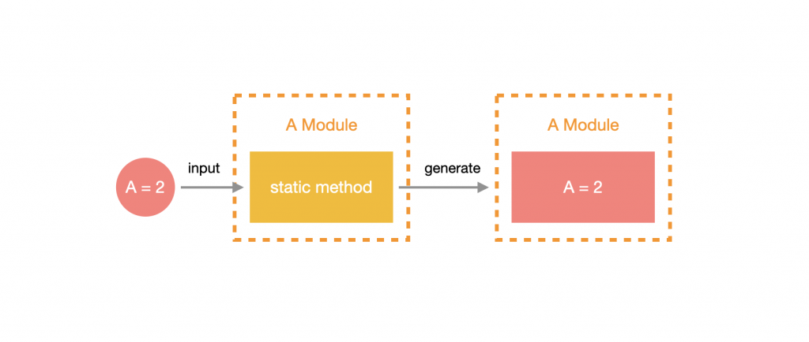

# Dynamic Module

**動態模組(Dynamic Module)** 可以用很簡單的方式去客製化 Provider 的內容，使該 Module 的 Provider 動態化。



## 設計 Dynamic Module

Dynamic Module 最常遇到的情境就是環境變數管理，原因是管理環境變數的邏輯通常是不變的，會變的部分僅僅是讀取環境變數的檔案路徑等，透過動態模組的機制成功將其抽離成共用元件，降低耦合度。

以下是運用動態組與 [dotenv](https://www.npmjs.com/package/dotenv) 實作的環境變數管理模組，名稱為 `ConfigurationModule`：

目標是讓 `ConfigurationModule` 提供一個靜態方法 `forRoot`，它可以接受一個包含 `key` 值為 `path` 的物件參數，`path` 即 `.env` 檔的相對路徑，透過 `forRoot` 將參數帶給 `ConfigurationService` 來處理 `.env` 的檔案並管理解析出來的變數。首先，透過 `npm` 安裝 `dotenv`：

```bash
npm install dotenv --save
```

透過 CLI 產生 `ConfigurationModule` 與 `ConfigurationService`：

```bash
nest generate module common/configuration
nest generate service common/configuration
```

接著替 `ConfigurationModule` 添加一個 `forRoot` 靜態方法，回傳的值即為 `DynamicModule`，而 `DynamicModule` 其實就是一個物件，與 `@Module` 裝飾器內的參數大致相同，不同的是必須要帶上 `module` 參數，其值為 `ConfigurationModule` 本身，另外，還有 `global` 參數可以使產生出來的 Module 變成全域：

```ts
import { DynamicModule, Module } from '@nestjs/common';
import { ConfigurationService } from './configuration.service';

// 因為只使用動態模組，而沒有特別設計靜態模組的部分，所以淨空 `@Module` 的參數。
@Module({})
export class ConfigurationModule {

  static forRoot(): DynamicModule {
    return {
      providers: [ConfigurationService],
      module: ConfigurationModule,
      global: true
    };
  }

}
```

>**注意**：靜態方法可以自行設計，但回傳值必須為同步或非同步 `DynamicModule`，名稱通常會使用 `forRoot` 或 `register`。

接下來要在 `forRoot` 設計包含 `key` 值為 `path` 的物件參數，並將 `path` 取出，運用 Value Provider 的方式將該值記錄下來。先在 `configuration` 資料夾下新增 `constants` 資料夾，並在裡面建立 `token.const.ts` 來管理 `token`：

```ts
export const ENV_PATH = 'ENV_PATH';
```

調整 `configuration.module.ts`：

```ts
import { DynamicModule, Module } from '@nestjs/common';
import { ConfigurationService } from './configuration.service';
import { ENV_PATH } from './constants/token.const';

// 並非靜態模組，拿掉 `@Module` 裝飾器所有參數。
@Module({})
export class ConfigurationModule {
  
    // 定義返回 `DynamicModule` 的靜態方法
    static forRoot(options: { path: string }): DynamicModule {

        /**
         * 根據 `DynamicModule` 的規格書，其屬性需求如下：
         * @property {Type<any>} module - 模組來源
         * @property {boolean} [global] - 是否為全域模組
         * 其餘屬性接繼承自 `ModuleMetadata`：`imports?`、`controllers?`、`providers?`、`exports?`
         */
        return {
            providers: [
                {
                    provide: ENV_PATH,
                    useValue: options.path
                },
                ConfigurationService
            ],
            exports: [ConfigurationService],
            module: ConfigurationModule,
            global: true
        }
    }
}
```

設計 `ConfigurationService` 的內容了，在 `constructor` 注入剛才設計的環境變數路徑 `ENV_PATH`，接著設計 `setEnvironment` 去讀取並解析 `.env` 檔，然後寫入 `config` 屬性中，最後設計一個 `get(key: string)` 的方法來提取要用的環境變數：

```ts
import { Inject, Injectable } from '@nestjs/common';

import * as fs from 'fs';
import * as path from 'path';
import * as dotenv from 'dotenv';

import { ENV_PATH } from './constants/token.const';

@Injectable()
export class ConfigurationService {

  // 存儲從 .env 檔案中解析出的環境變數。
  private config: any;

  // 使用 `@Inject()` 裝飾器將 `path` 參數標記為依賴注入，並將其值設定為從 `ENV_PATH` 常數 `token` 注入的值。
  constructor(@Inject(ENV_PATH) private readonly path: string) {
    // 呼叫 `setEnvironment()` 方法，初始化此服務。
    this.setEnvironment();
  }

  // 公開方法，用於從 `config` 屬性中獲取特定環境變數的值。
  public get(key: string): string {
    return this.config[key];
  }

  // 私有方法，解析 `.env` 檔案並將環境變數存儲在 `config` 屬性中。
  private setEnvironment(): void {

    // 使用 node built-in module 中的 `path.resolve()` 方法取得 `.env` 檔案的存放路徑
    // `path.resolve()`：根據傳入的路徑組合出一組絕對/相對路徑
    const filePath = path.resolve(__dirname, './', this.path);

    // 將 `.env` 轉換為 JS 物件並放置於 `this.config` 中。
    // `dotenv.parse()`：從指定的 `.env` 檔案中讀取內容並將其解析為一個 JS 物件
    // `fs.readFileSync()`：從指定的 `filePath` 讀取 `.env` 檔案的內容。這將返回一個包含 `.env` 檔案內容的原始文字串。
    this.config = dotenv.parse(fs.readFileSync(filePath));
  }
}
```

## 使用 Dynamic Module

先在專案路徑下新增 `development.env` 檔：

```text
USERNAME=VIC
```

調整 `app.module.ts` 的內容：

```ts
@Module({
  imports: [
    ConfigurationModule.forRoot({
      // 根據環境變數，選擇讀取不同 `.env`
      path: `${process.env.NODE_ENV || 'development'}.env`
    })
  ],
  controllers: [AppController],
  providers: [AppService]
})
export class AppModule {}
```

調整 `app.controller.ts` 的內容：

```ts
@Controller()
export class AppController {
  constructor(
    private readonly configService: ConfigurationService
  ) {}

  @Get()
  getHello() {
    return { username: this.configService.get('USERNAME') };
  }
}
```
