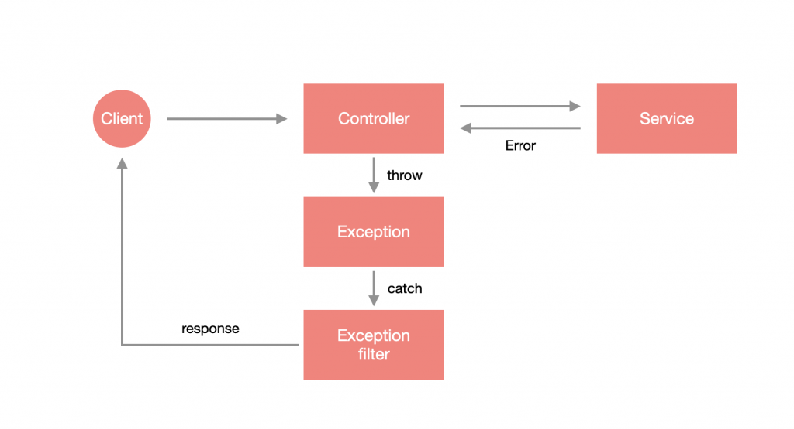

# Exception & Exception filters

## What is Exception?

系統發生了錯誤，導致原本程序無法完成的情況，這種時候會盡可能把錯誤轉化為有效資訊。

JS 中的 `Error`：

```js
throw new Error('some error')
```

### Nest 錯誤處理機制

在拋出錯誤後，需要有個機制去捕捉這些錯誤，並從中提取資訊來整理回應的格式，Nest 在底層已經幫我們做了一套錯誤處理機制 - **Exception filter**，它會去捕捉拋出的錯誤，並將錯誤訊息、HttpCode 進行友善地包裝，而 Nest 內建的 Exception filter 會去偵測拋出的錯誤是什麼類型的，它只能夠接受 Nest 內建的 `HttpException` 與繼承該類別的 Exception，若不屬於這類型的錯誤就會直接拋出 `Internal server error`。



## 標準 Exception

Nest 內建的標準 Exception 即為 `HttpException`，它是一個標準的 `class`，透過給定 `constructor` 兩個必填參數來自訂錯誤訊息與 HttpCode。

```ts
@Controller()
export class AppController {
  constructor(private readonly appService: AppService) {
  }

  @Get()
  getHello(): string {
    throw new HttpException('出錯囉!', HttpStatus.BAD_REQUEST);
    return this.appService.getHello();
  }
}
```

透過瀏覽器查看：

```json
{
  "statusCode": 400,
  "message": "出錯囉!"
}
```

若不想要用 Nest 的預設格式，可以把第一個錯誤訊息的參數換成 Object，Nest 會自動 覆蓋格式。

```ts
@Controller()
export class AppController {
  constructor(private readonly appService: AppService) {
  }

  @Get()
  getHello(): string {
    throw new HttpException(
      {
        code: HttpStatus.BAD_REQUEST,
        msg: '出錯囉!'
      },
        HttpStatus.BAD_REQUEST
      );
    return this.appService.getHello();
  }
}
```

透過瀏覽器查看：

```json
{
  "code": 400,
  "msg": "出錯囉!"
}
```

### Built-in Http Exception

- `BadRequestException`
- `UnauthorizedException`
- `NotFoundException`
- `ForbiddenException`
- `NotAcceptableException`
- `RequestTimeoutException`
- `ConflictException`
- `GoneException`
- `HttpVersionNotSupportedException`
- `PayloadTooLargeException`
- `UnsupportedMediaTypeException`
- `UnprocessableEntityException`
- `InternalServerErrorException`
- `NotImplementedException`
- `ImATeapotException`
- `MethodNotAllowedException`
- `BadGatewayException`
- `ServiceUnavailableException`
- `GatewayTimeoutException`
- `PreconditionFailedException`

## 自訂 Exception

```ts
import { HttpException, HttpStatus } from '@nestjs/common';

export class CustomException extends HttpException {
  constructor () {
    super('未知的錯誤', HttpStatus.INTERNAL_SERVER_ERROR);
  }
}
```

## 自訂 Exceotion Filter

若要完全掌握錯誤處理機制的話，Nest 是可以自訂 Exception filter 的，透過這樣的方式來添加 log，或是直接在這個層級定義回傳的格式。

Exception Filter 必須要使用 `@Catch(...exceptions: Type<any>[])` 裝飾器來捕捉錯誤，可以指定要捕捉特定類別的 Exception，也可以捕捉全部的錯誤，若要捕捉全部就不需要帶任何參數到 `@Catch` 裡，另外，還需要讓該 `class` 去實作 `ExceptionFilter<T>`，它會限制一定要設計 `catch(exception: T, host: ArgumentsHost)` 這個方法。

在 `src/filters` 下新增 `http-exception.filter.ts`，來建立一個捕捉 `HttpException` 的 Exception filter：

```ts
import { ArgumentsHost, Catch, ExceptionFilter, HttpException } from '@nestjs/common';
import { Response } from 'express';

@Catch(HttpException)
export class HttpExceptionFilter implements ExceptionFilter<HttpException> {
  catch(exception: HttpException, host: ArgumentsHost) {
    const ctx = host.switchToHttp();
    const response = ctx.getResponse<Response>();
    const status = exception.getStatus();
    const message = exception.message;
    const timestamp = new Date().toISOString();

    const responseObject = {
        code: status,
        message,
        timestamp
    };
    response.status(status).json(responseObject);
  }
}
```

在捕捉 `HttpException` 時，會獲得該 Exception 以及一個叫 `ArgumentsHost` 的東西，透過它來取得 Response 物件，進而回傳下方的格式到客戶端：

```json
{
  "code": 400,
  "message": "出錯囉!",
  "timestamp": "2021-09-23T06:45:55.216Z"
}
```

### ArgumentsHost

一個用來取得當前請求相關參數的 `class`，它是一個抽象概念，以 Express 作為底層的 REST API 來說，它封裝了 `req`、`res` 與 `next`，但如果是 MicroService 的話，封裝的內容物又不同了，所以 `ArgumentsHost` 提供了一些共同介面來取得這些底層的資訊：

#### 取得當前應用類型

透過 `getType()` 取得當前應用類型，以 REST API 來說，會得到字串 `http`：

```ts
host.getType() === 'http'; // true
```

#### 取得封裝參數

透過 `getArgs()` 取得當前應用類型下封裝的參數，以 Express 為底層的 REST API 來說，即 `req`、`res` 與 `next`：

```ts
const [req, res, next] = host.getArgs();
```

從上面可以得出封裝的參數為 **陣列格式**，Nest 提供了透過索引值取得參數的方法 - `getArgByIndex(index: number)`：

```ts
const req = host.getArgByIndex(0);
```

以上的方法都是透過對陣列的操作來取得相關參數，但這樣在面對不同架構的重用 **會有困難**，畢竟不同架構的封裝參數都會不同，這時候可以使用下方的方式來取得相關內容：

```ts
const rpcCtx: RpcArgumentsHost = host.switchToRpc(); // MicroService 的封裝內容
const httpCtx: HttpArgumentsHost = host.switchToHttp(); // REST 的封裝內容
const wsCtx: WsArgumentsHost = host.switchToWs(); // WebSocket 的封裝內容
```

### 使用 Exception filter

1. 單一資源：在 Controller 的方法中套用 `@UseFilters` 裝飾器，只會針對該資源套用。
2. Controller：直接在 Controller 上套用 `@UseFilters` 裝飾器，會針對整個 Controller 中的資源套用。

`@UseFilters` 的參數則帶入要使用的 Exception filter。

```ts
@Controller()
export class AppController {
  constructor(private readonly appService: AppService) {
  }

  @Get()
  @UseFilters(HttpExceptionFilter)
  getHello(): string {
    throw new BadRequestException('出錯囉!');
    return this.appService.getHello();
  }
}
```

下方為 Controller 套用的範例：

```ts
@Controller()
@UseFilters(HttpExceptionFilter)
export class AppController {
  constructor(private readonly appService: AppService) {
  }

  @Get()
  getHello(): string {
    throw new BadRequestException('出錯囉!');
    return this.appService.getHello();
  }
}
```

#### 全域 Exception filter

透過 `useGlobalFilters` 來指定全域的 Exception filter。

```ts
async function bootstrap() {
  const app = await NestFactory.create(AppModule);
  app.useGlobalFilters(new HttpExceptionFilter());
  await app.listen(3000);
}
bootstrap();
```

#### 用依賴注入實作全域 Exception filter

在 `AppModule` 進行配置，透過指定 `token` 為 `APP_FILTER` 來實現，這裡是用 `useClass` 來指定要建立實例的類別：

```ts
@Module({
  imports: [],
  controllers: [AppController],
  providers: [
    AppService,
    {
      provide: APP_FILTER,
      useClass: HttpExceptionFilter
    }
  ],
})
export class AppModule {}
```
