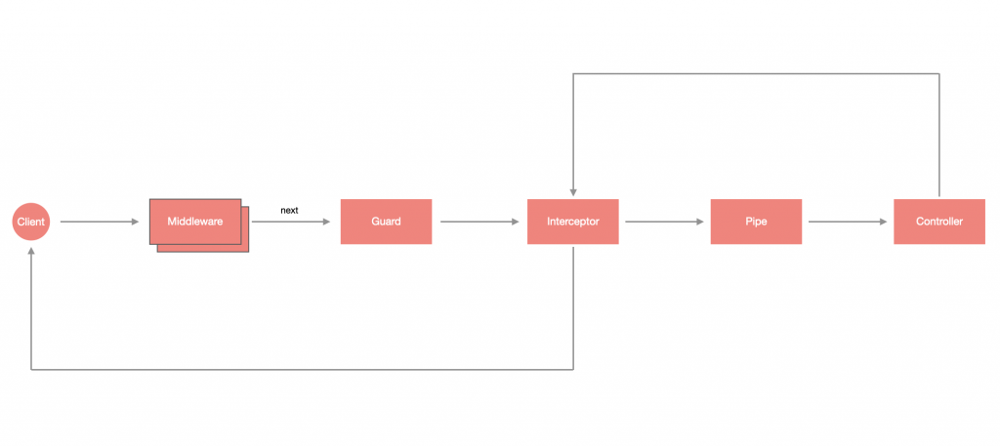

# Guard

Guard 是一種檢測機制，經常用在身份驗證與授權，當有未經授權的請求時，將會由 Guard 攔截並擋下。

從下圖可以看出 Guard 是執行在 Middleware 之後、Interceptor 之前：



## 設計 Guard

Guard 可以透過 CLI 產生：

```bash
nest generate guard <GUARD_NAME>
```

Guard 也是帶有 `@Injectable` 裝飾器的 `class`，不過它必須實作 `CanActivate` 介面，並設計 `canActivate(context: ExecutionContext)` 方法：

```ts
import { CanActivate, ExecutionContext, Injectable } from '@nestjs/common';
import { Observable } from 'rxjs';

@Injectable()
export class AuthGuard implements CanActivate {
  canActivate(
    context: ExecutionContext,
  ): boolean | Promise<boolean> | Observable<boolean> {
    return true;
  }
}
```

`canActive(context: ExecutionContext)` 可以是同步或非同步，所以回傳值可以是 `boolean`、`Promise<boolean>` 或 `Observable<boolean>`，如果要讓驗證通過，必須讓最終返回值為 `true`。

>**提醒**：會提供 `ExecutionContext` 是因為可以從這裡取出需要用來驗證的資料。

## 使用 Guard

在使用之前，先將 `auth.guard.ts` 修改一下，刻意將結果回傳 `false`，並採用非同步做法：

```ts
// ...
import { Observable, of } from 'rxjs';
import { delay } from 'rxjs/operators';

@Injectable()
export class AuthGuard implements CanActivate {
  canActivate(
    context: ExecutionContext,
  ): boolean | Promise<boolean> | Observable<boolean> {
    console.log('some unauthorized connections...');
    return of(false).pipe(delay(5000));
  }
}
```

透過 `@UseGuards` 裝飾器即可輕鬆套用，與 [Exception filters](./EXCEPTION.md) 、 [Pipe](./PIPE.md) 或 [Interceptor](./INTERCEPTOR.md) 一樣，可以套用在單一個 Controller 的方法上，或是直接套用在整個 Controller 上。

```ts
@Controller('todos')
@UseGuards(AuthGuard)
export class TodoController {
  @Get()
  getAll() {
    return [];
  }
}
```

## 全域 Guard

修改 `main.ts`，透過 `useGlobalGuards` 來配置全域 Guard：

```ts
async function bootstrap() {
  const app = await NestFactory.create(AppModule);
  app.useGlobalGuards(new AuthGuard());
  await app.listen(3000);
}
bootstrap();
```

### 用依賴注入實作全域 Guard

過指定 Provider 的 token 為 `APP_GUARD` 來實現，用 `useClass` 來指定要建立實例的類別：

```ts
// ...
import { APP_GUARD } from '@nestjs/core';

@Module({
  imports: [TodoModule],
  controllers: [AppController],
  providers: [
    AppService,
    {
      provide: APP_GUARD,
      useClass: AuthGuard
    }
  ]
})
export class AppModule {}
```
