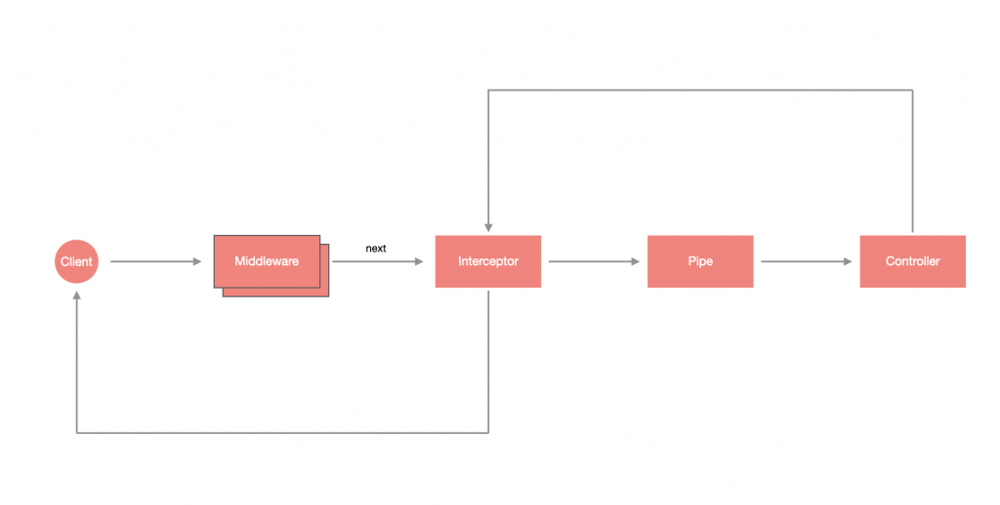

# Interceptor

- [設計 Interceptor](#設計-interceptor)
  - [CallHandler](#callhandler)
  - [ExecutionContext](#executioncontext)
    - [取得 Controller Class](#取得-controller-class)
    - [取得 Controller Method](#取得-controller-method)
- [使用 Interceptor](#使用-interceptor)
  - [全域 Interceptor](#全域-interceptor)
  - [用依賴注入實作全域 Interceptor](#用依賴注入實作全域-interceptor)

中文名稱為攔截器，受到 **剖面導向程式設計 (Aspect Oriented Programming)** 的啟發，為原功能的擴展邏輯，其特點如下：

- 可以在執行 Controller 的方法 **之前** 與 **之後** 設計邏輯。
- 執行於 Controller 的方法 **之前** 的 Interceptor 邏輯會在 Pipe 執行 **之前** 觸發。
- 執行於 Middleware **之後**。
- 可以更動資料與 Exception。



## 設計 Interceptor

Interceptor 可以透過 CLI 產生：

```bash
nest generate interceptor <INTERCEPTOR_NAME>
```

Interceptor 其實也是帶有 `@Injectable` 裝飾器的 `class`，不過它必須實作 `NestInterceptor` 介面，並設計 `intercept(context: ExecutionContext, next: CallHandler)` 方法：

```ts
import {
  CallHandler,
  ExecutionContext,
  Injectable,
  NestInterceptor,
} from '@nestjs/common';
import { Observable } from 'rxjs';

@Injectable()
export class HelloWorldInterceptor implements NestInterceptor {
  intercept(context: ExecutionContext, next: CallHandler): Observable<any> {
    return next.handle();
  }
}
```

### CallHandler

`CallHandler` 為 Interceptor 的重要成員，它實作了 `handle()` 來調用路由處理的方法，進而導入對應的 Controller 方法，也就是說，**如果在 Interceptor 不回傳 `CallHandler` 的 `handle()`**，**將會使路由處理失去運作**。

可以在回傳 `handle()` **之前** 寫一段邏輯，使其可以在進入 Controller 的方法前被執行，又因為 `handle()` 回傳的是 `Observable`，故可以透過 `pipe` 的方式 **對回傳值做調整**，使其可以在 Controller 的方法執行之後處理其他邏輯。

>**注意**：`handle()` 是 `Observable`，我們把它作為 `intercept` 的回傳值是希望 Nest 可以去 `subscribe` 它，根據 `Observable` 的特性，若沒有去 `subscribe` 它則不會執行其內部邏輯，這也是為什麼不回傳 `handle()` 的話將會使路由處理失去運作的原因。

### ExecutionContext

`ExecutionContext` 是繼承 `ArgumentsHost` 的 `class`，透過下面兩個方法可以大幅提升應用的靈活性：

#### 取得 Controller Class

透過 `getClass()` 取得當前請求對應的 Controller Class：

```ts
const Controller: TodoController = context.getClass<TodoController>();
```

#### 取得 Controller Method

透過 `getHandler()` 取得當前請求對應的 Controller method，假設當前請求會呼叫 `TodoController` 的 `getAll()`，那就會回傳 `getAll` 這個函式：

```ts
const method: Function = context.getHandler();
```

## 使用 Interceptor

在進入 Interceptor 時印出 `Hello World!` 並使用變數儲存進入的時間，再透過 `tap` 印出結束的時間與進入的時間差：

```ts
// ...
import { Observable } from 'rxjs';
import { tap } from 'rxjs/operators';

@Injectable()
export class HelloWorldInterceptor implements NestInterceptor {
  intercept(context: ExecutionContext, next: CallHandler): Observable<any> {
    console.log('Hello World!');
    const input = Date.now();
    const handler = next.handle();
    return handler.pipe(tap(() => console.log(`${Date.now() - input} ms`)));
  }
}
```

接著透過 `@UseInterceptors` 裝飾器即可輕鬆套用，與 [Exception filters](./EXCEPTION.md) 或 [Pipe](./PIPE.md) 一樣，可以套用在單一個 Controller 的方法上，或是直接套用在整個 Controller 上。

```ts
@Controller()
@UseInterceptors(HelloWorldInterceptor)
export class AppController {
  constructor(private readonly appService: AppService) {}

  @Get()
  getHello(): string {
    return this.appService.getHello();
  }
}
```

### 全域 Interceptor

透過 `useGlobalInterceptors` 來配置全域 Interceptor：

```ts
async function bootstrap() {
  const app = await NestFactory.create(AppModule);
  app.useGlobalInterceptors(new HelloWorldInterceptor());
  await app.listen(3000);
}
bootstrap();
```

### 用依賴注入實作全域 Interceptor

與 [Pipe](./PIPE.md) 一樣可以用依賴注入的方式，透過指定 Provider 的 `token` 為 `APP_INTERCEPTOR` 來實現，這裡是用 `useClass` 來指定要建立實例的類別：

```ts
// ...
import { APP_INTERCEPTOR } from '@nestjs/core';

@Module({
  imports: [],
  controllers: [AppController],
  providers: [
    AppService,
    {
      provide: APP_INTERCEPTOR,
      useClass: HelloWorldInterceptor
    }
  ]
})
export class AppModule {}
```
