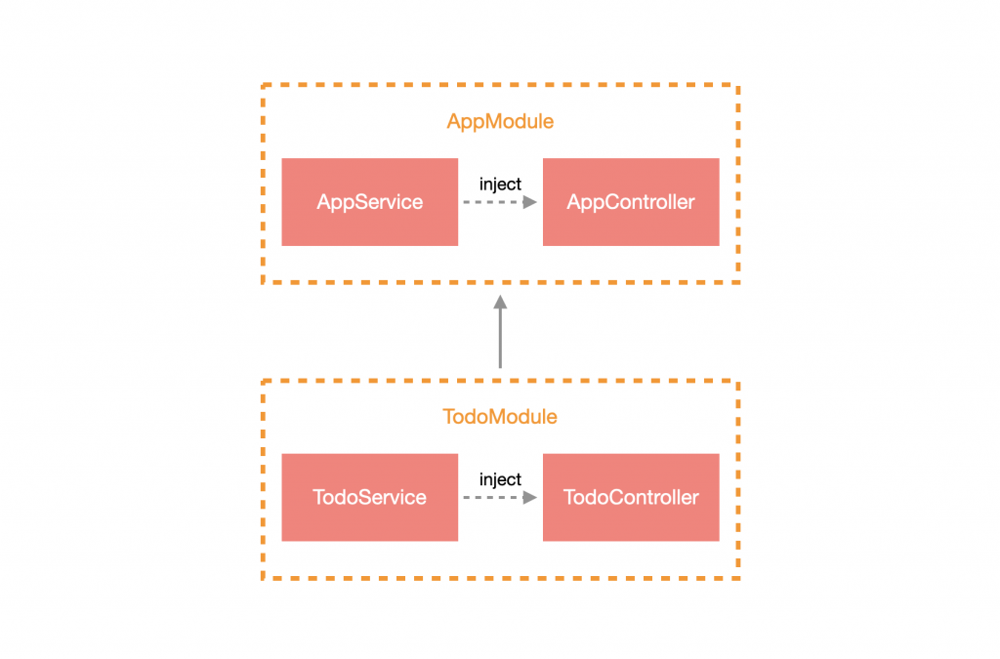
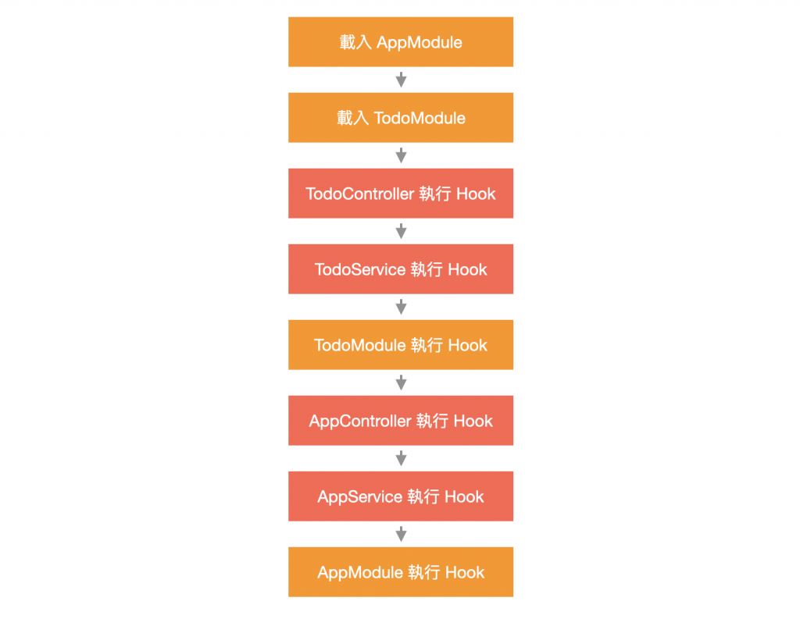
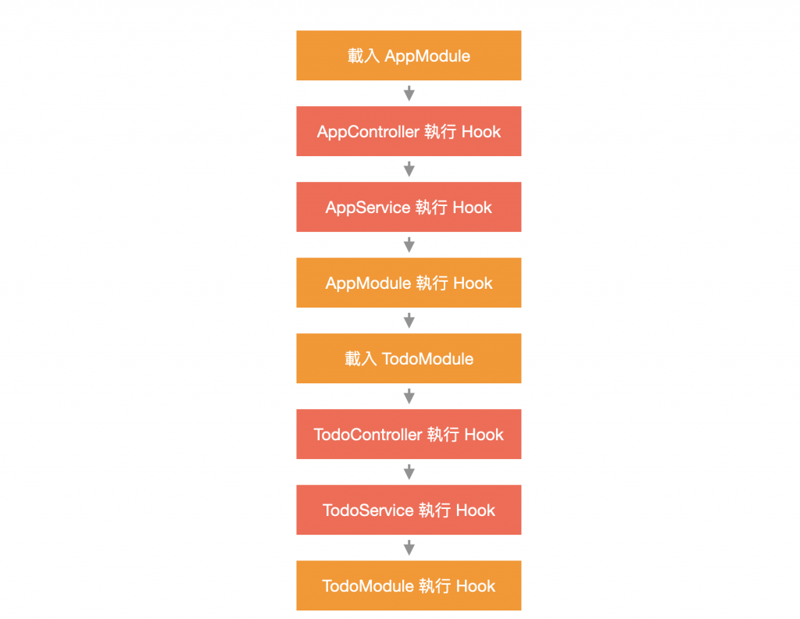

# Lifecycle Hooks

- [onModuleInit](#onmoduleinit)
- [onApplicationBootstrap](#onapplicationbootstrap)
- [onModuleDestroy](#onmoduledestroy)
- [beforeApplicationShutdown](#beforeapplicationshutdown)
- [onApplicationShutdown](#onapplicationshutdown)

Nest 也有設計 Lifecycle Hook，按照順序排列共分成下方五個時間點：

1. Module 初始化階段：`onModuleInit`
1. Nest App 啟動階段：`onApplicationBootstrap`
1. Module 銷毀階段：`onModuleDestroy`
1. Nest App 關閉前：`beforeApplicationShutdown`
1. Nest App 關閉階段：`onApplicationShutdown`

需特別注意的是，在關閉時間點的 Hook 必須要在 `bootstrap` 執行時調用 `app.enableShutdownHooks()` 來開啟此功能，會在執行 `app.close()` 或收到系統關閉訊號時 (`Ctrl + C`) 被觸發。

>**注意**：由於關閉時執行的 Hook 會消耗較多的效能在監聽事件上，故預設是不啟用的。

## onModuleInit

`onModuleInit` 會在該模組的依賴項目處理完畢時被調用。

假設 Nest App 有以下模組，其依賴關係如圖：



`AppModule` 會先被載入，載入的時候會去讀取它的依賴項目，當這些依賴項目處理完畢後 (依賴項目會先呼叫 `onModuleInit`)，`AppModule` 才會調用其 `onModuleInit`：



使用 `onModuleInit` 的模組必須實作 `OnModuleInit` 介面，並添加 `onModuleInit` 方法：

```ts
// ...
import { Module, OnModuleInit } from '@nestjs/common';

@Module({
  controllers: [AppController],
  providers: [AppService]
})
export class AppModule implements OnModuleInit {
  onModuleInit(): void {
    console.log('[AppModule]: initial event!');
  }
}
```

## onApplicationBootstrap

`onApplicationBootstrap` 在 **Nest App 初始化所有模組後**進行調用，會發生在連線建立前。與 `onModuleInit` 的執行順序相同，會先執行依賴項目的 `onApplicationBootstrap`。

使用 `onApplicationBootstrap` 的模組必須實作 `OnApplicationBootstrap` 介面，並添加 `onApplicationBootstrap` 方法：

```ts
// ...
import { Module, OnApplicationBootstrap  } from '@nestjs/common';

@Module({
  controllers: [AppController],
  providers: [AppService]
})
export class AppModule implements OnApplicationBootstrap  {
  onApplicationBootstrap(): void {
    console.log('[AppModule]: bootstrap event!');
  }
}
```

## onModuleDestroy

`onModuleDestroy` 在接收到系統關閉訊號或 `app.close()` 時調用。與 `onModuleInit` 的執行順序 **不同**，會從 `AppModule` 的 Controller 與 Provider 開始執行 `onModuleDestroy`，執行完之後 `AppModule` 就會觸發 `onModuleDestroy`，接著其依賴項目才會依序執行該 Hook。



>**注意**：在 Nest 第 8 版中，`onModuleDestroy` 的執行順序與 `onModuleInit` 相同。

使用 `onModuleDestroy` 的模組必須實作 `OnModuleDestroy` 介面，並添加 `onModuleDestroy` 方法：

```ts
// ...
import { Module, OnApplicationBootstrap  } from '@nestjs/common';

@Module({
  controllers: [AppController],
  providers: [AppService]
})
export class AppModule implements OnModuleDestroy  {
  onModuleDestroy(): void {
    console.log('[AppModule]: destroy event!');
  }
}
```

## beforeApplicationShutdown

`beforeApplicationShutdown` 在 Nest App 關閉所有連線之前調用，並會觸發 `app.close()`。與 `onModuleInit` 的執行順序相同。

使用 `beforeApplicationShutdown` 的模組必須實作 `BeforeApplicationShutdown` 介面，並添加 `beforeApplicationShutdown` 方法：

```ts
// ...
import { Module, BeforeApplicationShutdown  } from '@nestjs/common';

@Module({
  controllers: [AppController],
  providers: [AppService]
})
export class AppModule implements BeforeApplicationShutdown  {
  beforeApplicationShutdown(): void {
    console.log('[AppModule]: before shutdown event!');
  }
}
```

## onApplicationShutdown

`onApplicationShutdown` 在 Nest App 關閉所有連接時進行調用。與 `onModuleInit` 的執行順序相同。

使用 `onApplicationShutdown` 的模組必須實作 `OnApplicationShutdown` 介面，並添加 `onApplicationShutdown` 方法：

```ts
// ...
import { Module, OnApplicationShutdown  } from '@nestjs/common';

@Module({
  controllers: [AppController],
  providers: [AppService]
})
export class AppModule implements OnApplicationShutdown  {
  onApplicationShutdown(): void {
    console.log('[AppModule]: shutdown event!');
  }
}
```
