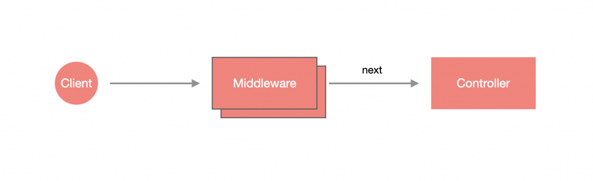

# Middleware

Middleware 是一種執行於路由處理之前的函式，可以存取請求物件與回應物件，並透過 next() 繼續完成後續的流程。



Middleware 的功能：

- 可執行任何程式。
- 更改請求物件或回應物件。
- 結束整個請求週期。
- 呼叫下一個執行步驟。
- 如果在 Middleware 沒有結束掉請求週期，需要使用 `next()` 呼叫下一個執行步驟。

## 設計 Middleware

Middleware 有兩種設計方式，一般的 `function` 或 帶有 `@Injectable` 裝飾器並實作 `NestMiddleware` 介面的 `class`：

### Functional Middleware

就是一個普通的 `function`，不過有三個參數，分別是：`Request`、`Response` 以及 `NextFunction`，使用方法與 Express middleware 是一樣的。

```ts
import { Request, Response, NextFunction } from 'express';

export function logger(req: Request, res: Response, next: NextFunction) {
  // ...
  next();
}
```

### Class Middleware

這種 Middleware 可以透過 CLI 產生：

```bash
nest generate middleware <MIDDLEWARE_NAME>
```

建立出來的 Middleware 骨架會看到有一個 `use(req: any, res: any, next: () => void)` 方法，那正是處理邏輯的地方：

```ts
@Injectable()
export class LoggerMiddleware implements NestMiddleware {
  use(req: any, res: any, next: () => void) {
    next();
  }
}
```

會發現參數型別一開始是 `any`，這是 Nest 不確定開發者選用的底層函式庫是哪個，如果用 Express，可以將參數改成：

```ts
import { Request, Response, NextFunction } from 'express';

@Injectable()
export class LoggerMiddleware implements NestMiddleware {
  use(req: Request, res: Response, next: NextFunction) {
    next();
  }
}
```

## 使用 Middleware

Middleware 的使用方式是在 Module 實作 `NestModule` 介面並設計 `configure()` 方法，再透過 `MiddlewareConsumer` 這個 Helper Class 來管理各個 Middleware。

在 `AppModule` 實作 `NestModule` 與 `configure(consumer: MiddlewareConsumer)` 方法，並透過 `apply` 來套用 Middleware，再透過 `forRoutes` 設置要採用此 Middleware 的路由：

```ts
import { Module, NestModule, MiddlewareConsumer } from '@nestjs/common';

@Module({
  imports: [TodoModule],
  controllers: [AppController],
  providers: [AppService],
})
export class AppModule implements NestModule {
  configure(consumer: MiddlewareConsumer) {
    consumer.apply(LoggerMiddleware).forRoutes('/todos');
  }
}
```

### 套用多個路由與指定 HttpMethod

`forRoutes` 支援多個路由，只需要添加路由到參數中即可，比較特別的是可以指定特定 Http Method 與路由，將含有 `path` 與 `method` 的物件帶入 `forRoutes` 中即可：

```ts
import {
  // ...
  RequestMethod,
} from '@nestjs/common';

@Module({
  imports: [TodoModule],
  controllers: [AppController],
  providers: [AppService],
})
export class AppModule implements NestModule {
  configure(consumer: MiddlewareConsumer) {
    consumer
      .apply(LoggerMiddleware)
      .forRoutes(
        { path: '/todos', method: RequestMethod.POST }, // [POST] /todos 會生效
        { path: '/', method: RequestMethod.GET }, // [GET] / 會生效
      );
  }
}
```

>**提醒**：`forRoutes` 也支援萬用路由。

### 套用 Controller

`forRoutes` 也支援套用整個 Controller，只要在該 Controller 下的資源都能觸發指定的 Middleware：

```ts
@Module({
  imports: [TodoModule],
  controllers: [AppController],
  providers: [AppService],
})
export class AppModule implements NestModule {
  configure(consumer: MiddlewareConsumer) {
    consumer
      .apply(LoggerMiddleware)
      .forRoutes(AppController);
  }
}
```

### 排除特定路由與指定 HttpMethod

可以透過 `exclude` 來指定要被排除的路由，使用方式與 `forRoutes` 差不多，透過給定含有 `path` 與 `method` 的物件來設置：

```ts
@Module({
  imports: [TodoModule],
  controllers: [AppController],
  providers: [AppService],
})
export class AppModule implements NestModule {
  configure(consumer: MiddlewareConsumer) {
    consumer
      .apply(LoggerMiddleware)
      .exclude(
        { path: '/todos', method: RequestMethod.GET }, // 排除 [GET] /todos
      )
      .forRoutes(AppController);
  }
}
```

### 套用多個 Middleware

`apply` 支援採用多個 Middleware，只需把 Middleware 添加到參數中即可。

```ts
@Module({
  imports: [TodoModule],
  controllers: [AppController],
  providers: [AppService]
})
export class AppModule implements NestModule {
  configure(consumer: MiddlewareConsumer) {
    consumer.apply(LoggerMiddleware, HelloWorldMiddleware).forRoutes(TodoController)
  }
}
```

### 全域 Middleware

如果要將 Middleware 套用在每一個資源上，可以在 `main.ts` 進行調整，只需要使用 use 方法即可：

```ts
async function bootstrap() {
  const app = await NestFactory.create(AppModule);
  app.use(logger);
  await app.listen(3000);
}
bootstrap();
```

>**注意**：在 `main.ts` 的方式僅支援 Function Middleware。

如果是 Class Middleware 則在 `AppModule` 實作 `NestModule`，並指定路由為 `*` 即可：

```ts
@Module({
  imports: [TodoModule],
  controllers: [AppController],
  providers: [AppService],
})
export class AppModule implements NestModule {
  configure(consumer: MiddlewareConsumer) {
    consumer.apply(LoggerMiddleware).forRoutes('*');
  }
}
```
