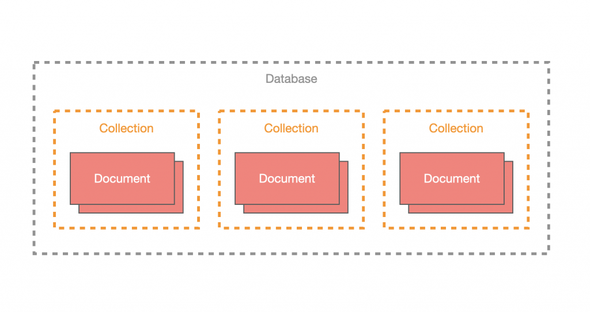

# MongoDB

- [安裝 Mongoose](#安裝-mongoose)
- [連線 MongoDB](#連線-mongodb)
  - [使用環境變數](#使用環境變數)
- [Mongoose 概念](#mongoose-概念)
  - [Schema](#schema)
  - [Model](#model)
- [Schema 設計](#schema-設計)
  - [Schema 裝飾器](#schema-裝飾器)
  - [Prop 裝飾器](#prop-裝飾器)
  - [製作 Document 型別](#製作-document-型別)
  - [巢狀物件型別](#巢狀物件型別)
  - [產生關聯](#產生關聯)
  - [產生 Schema](#產生-schema)
  - [實作範例 UserModel](#實作範例-usermodel)
- [使用 Model](#使用-model)
  - [建立 (Create)](#建立-create)
  - [讀取 (Read)](#讀取-read)
  - [更新 (Update)](#更新-update)
  - [刪除 (Delete)](#刪除-delete)
- [Hook 功能](#hook-功能)

## 安裝 Mongoose

node.js 與 MongoDB 溝通最有名的函式庫即 [mongoose](https://mongoosejs.com/)，它採用了 `schema-based` 的 ODM 套件，而 Nest 又對 mongoose 進行了包裝，製作了 `MongooseModule` 讓習慣用 `mongoose` 的開發人員可以使用。

除了安裝 Nest 製作的模組外，還需要安裝 `mongoose` 本身：

```text
npm install @nestjs/mongoose mongoose
```

## 連線 MongoDB

在 `AppModule` 下匯入 `MongooseModule` 並使用 `forRoot` 方法來進行連線，效果等同於 `mongoose` 中的 `connect` 方法。

```ts
// ...
import { MongooseModule } from '@nestjs/mongoose';

const MONGO_URL = `mongodb+srv://<username>:<password>@<db_resource>/?retryWrites=true&w=majority`

@Module({
  imports: [
    MongooseModule.forRoot(MONGO_URL)
  ],
  controllers: [AppController],
  providers: [AppService],
})
export class AppModule {}
```

### 使用環境變數

`MongooseModule` 提供了 `forRootAsync` 方法，透過這個方法可以把依賴項目注入進來，使 `MongooseModule` 在建立時可以使用依賴項目來賦予值。運用這個特性將 `ConfigModule` 引入，並注入 `ConfigService` 進而取出我們要的環境變數來配置 MongoDB 的來源。

將 MongoDB 的相關配置寫入 `.env` 檔：

```text
MONGO_USERNAME=YOUR_USERNAME
MONGO_PASSWORD=YOUR_PASSWORD
MONGO_RESOURCE=YOUR_RESOURCE
```

接著，運用 [命名空間](./CONFIGMODULE.md#使用工廠函式配置命名空間) 技巧，將 MongoDB 相關的環境變數歸類在 mongo 底下。

在 `src/config` 資料夾下新增 `mongo.config.ts` 來實作該工廠函式：

```ts
import { registerAs } from '@nestjs/config';

export default registerAs('mongo', () => {
  const username = process.env.MONGO_USERNAME;
  // MongoDB 要求連線時的密碼必須經過 URL encoded
  const password = encodeURIComponent(process.env.MONGO_PASSWORD);
  const resource = process.env.MONGO_RESOURCE;
  const uri = `mongodb+srv://${username}:${password}@${resource}?retryWrites=true&w=majority`;
  return { username, password, resource, uri };
});
```

修改 `app.module.ts`：

```ts
// ...
import { ConfigModule, ConfigService } from '@nestjs/config';
import MongoConfigFactory from './config/mongo.config';

@Module({
  imports: [
    ConfigModule.forRoot({
      load: [MongoConfigFactory]
    }),
    MongooseModule.forRootAsync({
      imports: [ConfigModule],
      inject: [ConfigService],
      useFactory: async (config: ConfigService) => ({
        uri: config.get<string>('mongo.uri')
      })
    })
  ],
  controllers: [AppController],
  providers: [AppService],
})
export class AppModule {}
```

## mongoose 概念

`mongoose` 主要是由兩大元素構成：`schema`、`model`。

### Schema

一個 `schema` 都對應到一個 `collection`，它會制定該 `collection` 下所有 `document` 的欄位與欄位規則，而 `document` 為 MongoDB 最基本的元素，也就是一筆資料，而很多個 `document` 所形成的集合為 `collection`，其概念如下：



### Model

`schema` 只是制定了規則，無法直接透過它來存取資料庫，真正執行存取的元素為 `model`，所有的 `model` 都是基於 `schema` 產生的，透過 `model` 便可以操作該 `schema` 所控管的 `collection`，並且所有建立、修改、查詢都會根據 `schema` 制定的欄位來操作。

## Schema 設計

在 Nest 要設計 schema 有兩種方式：

1. `mongoose` 原生的做法。
1. Nest 設計的裝飾器。

透過 Nest 裝飾器設計的 schema 主要是由 `@Schema` 與 `@Prop` 所構成。

### Schema 裝飾器

`@Schema` 裝飾器會將一個 `class` 定義為 `schema` 的格式，並且可以接受一個參數，該參數對應到 `mongoose` 的 `schema` 選項配置，詳細內容參考[官方文件](https://mongoosejs.com/docs/guide.html#options)。

### Prop 裝飾器

`@Prop` 裝飾器定義了 `document` 的欄位，其使用在 `class` 中的屬性，它擁有基本的型別推斷功能，讓開發人員在面對簡單的型別可以不需特別做指定，但如果是陣列或巢狀物件等複雜的型別，則需要在 `@Prop` 帶入參數來指定其型別，而帶入的參數其實就是 `mongoose` 的 `SchemaType`，詳細內容可以參考官方文件。

### 製作 Document 型別

1. `schema` 是定義 `document` 的資料結構。
1. `model` 是基於 `schema` 所產生出來的。

根據這兩點，可以簡單推斷出 `model` 的操作會返回的東西為 `document`，所以 `mongoose` 也提供了基本的 `Document` 型別，但因為 `document` 會根據 `schema` 定義的資料結構而有所不同，故我們需要設計一個 `type` 來讓之後 `model` 可以順利拿到 `schema` 定義的欄位。

### 巢狀物件型別

使用函式 `raw`，它可以讓開發人員在不額外建立 `class` 的情況下，用 `mongoose` 原生的寫法來定義該欄位的型別與規則。

### 產生關聯

`mongoose` 可以將多個相關 `collection` 的資料產生關聯，透過 `populate` 的方法讓別的 `collection` 資料能夠被找到且帶入。

### 產生 Schema

設計好 `schema` 之後，就要將 `schema` 透過 `SchemaFactory` 的 `createForClass` 方法產生出這個 `schema` 的實體。

### 實作範例 UserModel

以下是根據 Schema 以及 DTO 的實作範例。

`user.model.ts`：

```ts
import { Prop, raw, Schema, SchemaFactory } from '@nestjs/mongoose';
import { IsNotEmpty, IsString, ValidateNested } from 'class-validator';
import { PartialType } from '@nestjs/swagger';
import { Type } from 'class-transformer';
import { Document } from 'mongoose';

// 製作 Document 型別
export type UserDocument = User & Document;

// Schema 裝飾器
@Schema()
export class User {
  // Prop 裝飾器
  @Prop(
    // 巢狀物件型別
    raw({
      firstName: { type: String },
      lastName: { type: String },
      fullName: { type: String },
    }),
  )
  name: Record<string, any>;

  @Prop({ required: true })
  email: string;
}

// 產生 Schema
export const UserSchema = SchemaFactory.createForClass(User);

export class UserNameDTO {
  @IsString()
  @IsNotEmpty()
  firstName: string;

  @IsString()
  @IsNotEmpty()
  lastName: string;

  @IsString()
  @IsNotEmpty()
  fullName: string;
}

export class UserDTO {
  @ValidateNested()
  @Type(() => UserNameDTO)
  name: UserNameDTO;

  @IsString()
  @IsNotEmpty()
  email: string;
}

export class UpdateUserNameDTO extends PartialType(UserNameDTO) {}

export class UpdateUserDTO extends PartialType(UserDTO) {}
```

`todo.model.ts`：

```ts
import { Schema, Prop, SchemaFactory } from '@nestjs/mongoose';
import { Document, Types } from 'mongoose';
import { User } from './user.model';

export type TodoDocument = Todo & Document;

@Schema()
export class Todo {
  @Prop({ required: true, maxlength: 20 })
  title: string;

  @Prop({ maxlength: 200 })
  description: string;

  @Prop({ required: true })
  completed: boolean;

  // 產生關聯
  @Prop({ type: Types.ObjectId, ref: 'User' })
  owner: User;
}

export const TodoSchema = SchemaFactory.createForClass(Todo);
```

## 使用 Model

先建立 `UserModule`、`UserController` 以及 `UserService` 來替我們的 API 做準備：

```text
nest generate module features/user
nest generate controller features/user
nest generate service features/user
```

`MongooseModule` 有提供 `forFeature` 方法來配置 `MongooseModule`，並在該作用域下定義需要的 `model`，使用方式很簡單，給定一個陣列其內容即為 **要使用的 schema** 與 **對應的 collection 名稱**，通常我們習慣直接使用 `schema` 的 `class` 名稱作為值，其最終會對應到的 `collection` 為 **名稱 + s**，舉例來說，`User` 會對應到的 `collection` 名稱即 `users`。

修改 `user.module.ts`：

```ts
// ...
import { MongooseModule } from '@nestjs/mongoose';
import { User, UserSchema } from '../../common/models/user.model';
import { UserController } from './user.controller';
import { UserService } from './user.service';

@Module({
  imports: [
    MongooseModule.forFeature([
      { name: User.name, schema: UserSchema }
    ])
  ],
  controllers: [UserController],
  providers: [UserService]
})
export class UserModule {}
```

之後透過 `@InjectModel` 來將 `User` 的 `model` 注入到 `UserService` 中，並給定型別 `UserDocument`：

```ts
import { InjectModel } from '@nestjs/mongoose';
import { Model } from 'mongoose';
import { User, UserDocument } from '../../common/models/user.model';

@Injectable()
export class UserService {
  constructor(
    @InjectModel(User.name) private readonly userModel: Model<UserDocument>
  ) {}
}
```

`UserController` 也可以先基本的架構設定好：

```ts
import { Controller, ValidationPipe, UsePipes } from '@nestjs/common';
import { UserService } from './user.service';

@Controller('users')
@UsePipes(ValidationPipe)
export class UserController {
  constructor(private readonly userService: UserService) {}
}
```

以下為 `UserService` 與 `UserController` 中方法的範例：

### 建立 (Create)

```ts
create(user: UserDTO) {
  return this.userModel.create(user);
}
```

```ts
@Post()
create(@Body() body: UserDTO) {
  return this.userService.create(body);
}
```

### 讀取 (Read)

```ts
// 取得 collection 內全部 document
findAll() {
  return this.userModel.find();
}

// 依 `_id` 查找
findById(id: string) {
  return this.userModel.findById(id);
}
```

```ts
@Get()
findAll() {
  return this.userService.findAll();
}

@Get(':id')
findById(@Param('id') id: string) {
  return this.userService.findById(id);
}
```

### 更新 (Update)

```ts
updateById(id: string, data: UpdateUserDTO) {
  return this.userModel.findByIdAndUpdate(id, data, { new: true });
}
```

>**注意**：上方的 `new` 參數是讓 `mongoose` 回傳更新後的結果，預設為 `false`。

```ts
@Patch(':id')
updateById(@Param('id') id: string, @Body() body: UpdateUserDTO) {
  return this.userService.updateById(id, body);
}
```

### 刪除 (Delete)

```ts
removeById(id: string) {
  return this.userModel.findByIdAndRemove(id);
}
```

```ts
@Delete(':id')
removeById(@Param('id') id: string) {
  return this.userService.removeById(id);
}
```

## Hook 功能

`mongoose` 有提供 Hook 讓開發人員使用，其屬於 `schema` 的層級，需要在 `model` 建立之前註冊，使用 `MongooseModule` 的 `forFeatureAsync` 方法來實作工廠函式。

以 `user.module.ts` 為例，我們透過 `UserSchema` 的 `pre` 方法來介接 **動作發生之前** 的 hook，這裡以 `save` 為例，其觸發時間點為儲存之前：

```ts
@Module({
  imports: [
    MongooseModule.forFeatureAsync([
      {
        name: User.name,
        useFactory: () => {
          UserSchema.pre('save', function (this: UserDocument, next) {
            console.log(this);
            next();
          });
          return UserSchema;
        },
      },
    ]),
  ],
  controllers: [UserController],
  providers: [UserService],
})
export class UserModule {}
```
