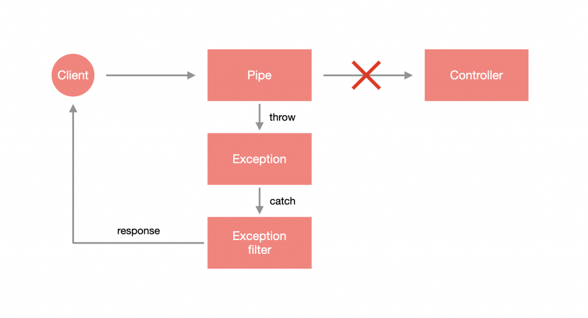

# Pipe

Pipe 經常被用來處理使用者傳入的參數，比如：驗證參數的正確性、型別的轉換等。

- [Nest Pipe](#nest-pipe)
  - [使用 Pipe](#使用-pipe)
    - [內建 Pipe 自訂 HttpCode](#內建-pipe-自訂-httpcode)
    - [內建 Pipe 自訂 Exception](#內建-pipe-自訂-exception)
  - [自訂 Pipe](#自訂-pipe)
  - [DTO 格式驗證](#dto-格式驗證)
    - [關閉錯誤細項](#關閉錯誤細項)
    - [自訂 Exception](#自訂-exception)
    - [自動過濾屬性](#自動過濾屬性)
    - [自動轉換](#自動轉換)
    - [檢測陣列 DTO](#檢測陣列-dto)
      - [解析 Query](#解析-query)
    - [DTO 技巧](#dto-技巧)
      - [局部性套用 Partial](#局部性套用-partial)
      - [選擇性套用 Pick](#選擇性套用-pick)
      - [忽略套用 Omit](#忽略套用-omit)
      - [合併套用 Intersection](#合併套用-intersection)
      - [組合應用](#組合應用)
  - [全域 Pipe](#全域-pipe)
    - [依賴注入實作全域 Pipe](#依賴注入實作全域-pipe)

## Nest Pipe

在 Nest 中，Pipe 支援 Exception 的錯誤處理機制，當在 Pipe 拋出 Exception 時，該次請求就 不會 進入到 Controller 對應的方法裡，這樣的設計方法能夠有效隔離驗證程序與主執行程序，是非常好的實作方式。



Nest 內建了以下幾個 Pipe 來輔助資料轉型與驗證：

- `ValidationPipe`：驗證資料格式的 Pipe。
- `ParseIntPipe`：解析並驗證是否為 Integer 的 Pipe。
- `ParseBoolPipe`：解析並驗證是否為 Boolean 的 Pipe。
- `ParseArrayPipe`：解析並驗證是否為 Array 的 Pipe。
- `ParseUUIDPipe`：解析並驗證是否為 UUID 格式的 Pipe。
- `DefaultValuePipe`：驗證資料格式的 Pipe。

### 使用 Pipe

假設要解析並驗證路由參數是否為 `Integer` 的話，只需要在 `@Param` 裝飾器填入路由參數名稱並帶入 `ParseIntPipe` 即可。

以 `app.controller.ts` 為例，如果 `id` 解析後為數字，就會透過 `AppService` 去取得對應的 User 資訊，否則會拋出 Exception：

```ts
import { Controller, Get, Param, ParseIntPipe } from '@nestjs/common';
import { AppService } from './app.service';

@Controller()
export class AppController {
  constructor(private readonly appService: AppService) {}

  @Get(':id')
  getUser(@Param('id', ParseIntPipe) id: number) {
    return this.appService.getUser(id);
  }

}
```

#### 內建 Pipe 自訂 HttpCode

假設想要更改錯誤訊息，那 `ParseIntPipe` 就必須實例化並帶入相關參數，以 `app.controller.ts` 為例，我希望出錯時收到的 HttpCode 是 `406`：

```ts
@Controller()
export class AppController {
  constructor(private readonly appService: AppService) {}

  @Get(':id')
  getUser(
    @Param('id', new ParseIntPipe({ errorHttpStatusCode: HttpStatus.NOT_ACCEPTABLE }))
    id: number
  ) {
    return this.appService.getUser(id);
  }

}
```

#### 內建 Pipe 自訂 Exception

如果想要自訂錯誤訊息的話，可以使用 `exceptionFactory` 這個參數來指定產生的 Exception。以 `app.controller.ts` 為例：

```ts
@Controller()
export class AppController {
  constructor(private readonly appService: AppService) {}

  @Get(':id')
  getUser(
    @Param(
      'id',
      new ParseIntPipe({
        exceptionFactory: () => new NotAcceptableException('無法解析為數字')
      })
    )
    id: number
  ) {
    return this.appService.getUser(id);
  }

}
```

### 自訂 Pipe

Pipe 就是一個帶有 `@Injectable` 的 class，不過它要去實作 `PipeTransform` 這個介面。Pipe 可以透過 CLI 產生：

```bash
nest generate pipe <PIPE_NAME>
```

下方為 Pipe 的骨架，會看到有一個 `transform(value: any, metadata: ArgumentMetadata)` 方法，這就是要做邏輯判斷的地方，其中，`value` 為傳進來的值，`metadata` 為當前正在處理的參數元數據：

```ts
import { ArgumentMetadata, Injectable, PipeTransform } from '@nestjs/common';

@Injectable()
export class ParseIntPipe implements PipeTransform {
  transform(value: any, metadata: ArgumentMetadata) {
    return value;
  }
}
```

>**注意**：`PipeTransform` 後面可以添加兩個 Type，第一個為 `T`，定義傳入的值應該為何種型別，也就是 `transform` 裡面的 `value`，第二個為 `R`，定義回傳的資料型別。

這裡我們調整一下 `parse-int.pipe.ts`，經過 `parseInt` 之後的 `value` 是否為 `NaN`，如果是則會拋出 `NotAcceptableException`：

```ts
@Injectable()
export class ParseIntPipe implements PipeTransform<string, number> {
  transform(value: string, metadata: ArgumentMetadata) {
    const integer = parseInt(value);
    if ( isNaN(integer) ) {
      throw new NotAcceptableException('無法解析為數字');
    }
    return integer;
  }
}
```

接著去修改 `app.controller.ts`，來套用看看自己設計的 `ParseIntPipe`：

```ts
@Controller()
export class AppController {
  constructor(private readonly appService: AppService) {}

  @Get(':id')
  getUser(
    @Param('id', ParseIntPipe) id: number
  ) {
    return { id }
  }

}
```

透過瀏覽器查看 `http://localhost:3000/asd` 會得到下方結果：

```json
{
  "statusCode": 406,
  "message": "無法解析為數字",
  "error": "Not Acceptable"
}
```

### DTO 格式驗證

驗證物件格式的資料可以使用 DTO、`ValidationPipe`、`class-validator` 以及 `class-transformer`。

先透過 `npm` 安裝 `class-validator` 與 `class-transformer`：

```bash
npm install --save class-validator class-transformer
```

在驗證格式機制上，必須要採用 `class` 的形式建立 DTO，如果採用 `interface` 的方式在編譯成 JS 時會被刪除，Nest 便無法得知 DTO 的格式為何。

1. 首先建立一個 DTO：

    ```ts
    export class CreateTodoDto {
      public readonly title: string;
      public readonly description?: string;
    }
    ```

2. 再來透過 class-validator 替這些屬性添加特定的裝飾器：

    ```ts
    import { IsNotEmpty, IsOptional, IsString, MaxLength } from 'class-validator';


    export class CreateTodoDto {
      @MaxLength(20) // 最大長度 20
      @IsString() // 須為字串
      @IsNotEmpty() // 不為空值
      public readonly title: string;

      @IsString() // 須為字串
      @IsOptional() // 非必要屬性
      public readonly description?: string;
    }
    ```

    >**提醒**：詳細的裝飾器內容可以參考 [class-validator](https://github.com/typestack/class-validator)。

3. 在 Controller 上透過 `@UsePipes` 裝飾器套用 `ValidationPipe` 即可：

    ```ts
    import { Body, Controller, Post, UsePipes, ValidationPipe } from '@nestjs/common';
    import { CreateTodoDto } from './dto/create-todo.dto';

    @Controller('todos')
    export class TodoController {

      @Post()
      @UsePipes(ValidationPipe)
      create(@Body() dto: CreateTodoDto) {
        return {
          id: 1,
          ...dto
        };
      }

    }
    ```

    或是在 Controller 層級套用也可以，就會變成該 Controller 下的所有資源都支援驗證。

    還有一種方式是將 `ValidationPipe` 傳入參數裝飾器使用：

    ```ts
    @Post()
    create(@Body(ValidationPipe) dto: CreateTodoDto) {
      return {
        id: 1,
        ...dto
      };
    }
    ```

#### 關閉錯誤細項

如果不想要回傳錯誤的項目，可以透過 `ValidationPipe` 的 `disableErrorMessages` 來關閉：

```ts
@Post()
@UsePipes(new ValidationPipe({ disableErrorMessages: true }))
create(@Body() dto: CreateTodoDto) {
  return {
    id: 1,
    ...dto
  };
}
```

#### 自訂 Exception

與其他 Pipe 一樣可以透過 `exceptionFactory` 自訂 Exception：

```ts
@Post()
@UsePipes(
  new ValidationPipe({
    exceptionFactory: (errors: ValidationError[]) => {
      return new NotAcceptableException({
        code: HttpStatus.NOT_ACCEPTABLE,
        message: '格式錯誤',
        errors
      });
    }
  })
)
create(@Body() dto: CreateTodoDto) {
  return {
    id: 1,
    ...dto
  };
}
```

#### 自動過濾屬性

當 `whitelist` 為 `true` 時，會 **自動過濾掉於 DTO 沒有任何裝飾器的屬性**，DTO 就算有該屬性但沒有添加 `class-validator` 的裝飾器也會被視為無效屬性。

若是同時使用 `whitelist` 與 `forbidNonWhitelisted`，則會在接收到無效參數時會直接 response 錯誤訊息。

#### 自動轉換

`transform` 參數會將傳入的物件實例化為對應的 DTO。

若用在路由參數，因路由參數收到的時候都會是 `string`，透過 `transform` Nest 會嘗試去轉換成指定的型別。

#### 檢測陣列 DTO

如果傳入的物件為陣列格式，不能使用 `ValidationPipe`，要使用 `ParseArrayPipe`，並在 `items` 帶入其 DTO：

```ts
@Post()
create(
  @Body(new ParseArrayPipe({ items: CreateTodoDto }))
  dtos: CreateTodoDto[]
) {
  return dtos;
}
```

##### 解析 Query

假設 Query 為 `?ids=1,2,3`，此時就可以善用此方法來解析出各個 `id`，只需要添加 `separator` 去判斷以什麼作為分界點：

```ts
@Get()
get(
  @Query('ids', new ParseArrayPipe({ items: Number, separator: ',' }))
  ids: number[]
) {
  return ids;
}
```

#### DTO 技巧

當許多的 DTO 有重複的屬性時，可以運用特殊的繼承方式來處理。

以下的繼承方法皆來自於 `@nestjs/swagger`，需另外安裝：

```text
npm install @nestjs/swagger
```

##### 局部性套用 Partial

繼承 **該 DTO 所有欄位**，但全部轉換為**非必要**屬性。

用 `PartialType` 這個函式來把要取用的 DTO 帶進去，並給新的 DTO 繼承：

```ts
export class UpdateTodoDto extends PartialType(CreateTodoDto) {}
```

如此，新 DTO 會繼承原 DTO 所有屬性，但全部會成為非必要屬性，並於各個屬性上新增 `@IsOptional` 裝飾器。

##### 選擇性套用 Pick

用既有的 DTO 去**選擇**哪些是會用到的屬性，使用 `PickType` 來把要取用的 DTO 帶進去以及指定要取用的屬性名稱，並繼承給新的 DTO：

```ts
export class UpdateTodoDto extends PickType(CreateTodoDto,  ['title']) {}
```

`UpdateTodoDto` 繼承了 `CreateTodoDto` 中的 `title` 屬性。

##### 忽略套用 Omit

用既有的 DTO 但**忽略**不會用到的屬性，使用 `OmitType` 把要取用的 DTO 帶進去以及指定要忽略的屬性名稱：

```ts
export class UpdateTodoDto extends OmitType(CreateTodoDto,  ['title']) {}
```

`UpdateTodoDto` 繼承了 `CreateTodoDto` 中除了 `title` 以外的屬性。

##### 合併套用 Intersection

用既有的**兩個** DTO 來合併屬性，使用 `IntersectionType` 把要取用的兩個 DTO 帶進去，並給新的 DTO 繼承：

```ts
export class UpdateTodoDto extends IntersectionType(CreateTodoDto, MockDto) {}
```

`UpdateTodoDto` 繼承了 `CreateTodoDto` 與 `MockDto` 的所有屬性。

##### 組合應用

`PartialType`、`PickType`、`OmitType`、`IntersectionType` 可以透過組合的方式來使用：

```ts
export class UpdateTodoDto extends IntersectionType(
    OmitType(CreateTodoDto, ['title']), MockDto
) {}
```

將 `CreateTodoDto` 的 `title` 屬性剔除，再與 `MockDto` 合併後，繼承給 `UpdateTodoDto`。

## 全域 Pipe

`ValidationPipe` 是一個常用的功能，因為大多數的情況都會使用到 DTO，所以可以透過 `useGlobalPipes` 使 `ValidationPipe` 適用於全域：

```ts
// main.ts
async function bootstrap() {
  const app = await NestFactory.create(AppModule);
  app.useGlobalPipes(new ValidationPipe());
  await app.listen(3000);
}
bootstrap();
```

### 依賴注入實作全域 Pipe

上面的方法是透過模組外部完成全域配置的，與 Exception filter 一樣可以用依賴注入的方式，透過指定 Provider 的 `token` 為 `APP_PIPE` 來實現，這裡是用 `useClass` 來指定要建立實例的類別：

```ts
// app.module.ts
// ...
import { APP_PIPE } from '@nestjs/core';

@Module({
  imports: [TodoModule],
  controllers: [AppController],
  providers: [
    AppService,
    {
      provide: APP_PIPE,
      useClass: ValidationPipe
    }
  ],
})
export class AppModule {}
```
