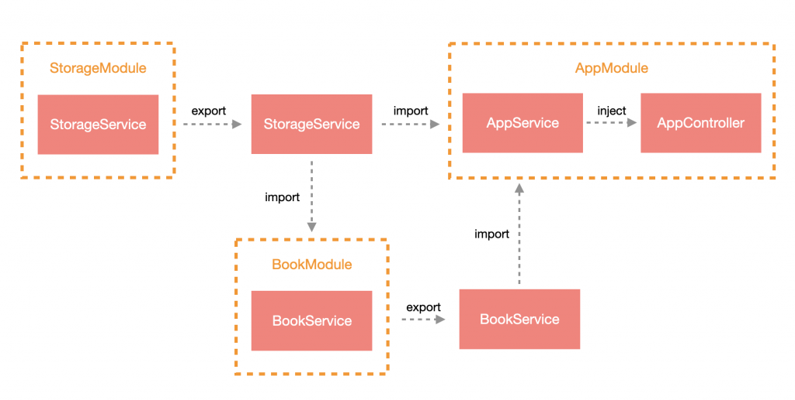
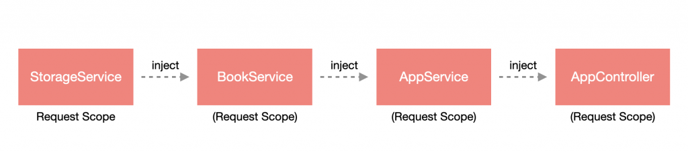
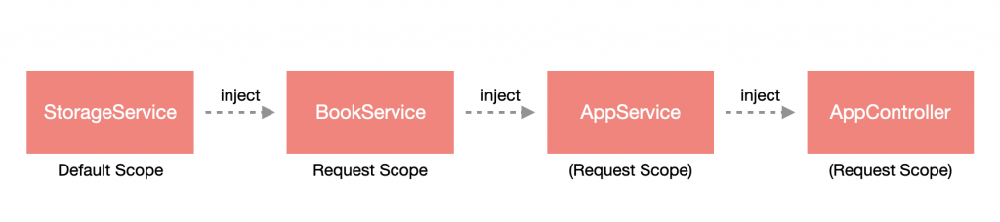

# Scope

Nest 在大多數情況下是採用 **單例模式 (Singleton pattern)** 來維護各個實例，但有些情況可能就需要針對各個請求做處理，這時候可以透過調整 **注入作用域 (Injection scope)** 來決定實例的建立時機。

>**注意**：雖然說可以調整建立實例時機，如非必要還是建議採用單例模式，原因是可以提升系統整體效能。

## 作用域

Nest 共有三種作用域：

1. **預設作用域 (Default scope)**：即單例模式之作用域。
2. **請求作用域 (Request scope)**：為每個請求建立全新的實例，在該請求中的 Provider 是共享實例的，請求結束後將會進行垃圾回收。
3. **獨立作用域 (Transient scope)**：每個 Provider 都是獨立的實例，在各 Provider 之間不共享。

### Provider 設置作用域

Provider 設定作用域只要在 `@Injectable` 裝飾器中做配置即可，它有提供一個選項參數 `scope` 來做指定，而作用域參數可以透過 Nest 提供的 `enum` - `Scope` 來配置。

```ts
import { Injectable, Scope } from '@nestjs/common';

@Injectable({ scope: Scope.REQUEST })
export class AppService {
  getHello(): string {
    return 'Hello World!';
  }
}
```

如果是自訂 Provider，就多一個 `scope` 的屬性。

```ts
@Module({
  imports: [],
  controllers: [AppController],
  providers: [
    AppService,
    {
      provide: 'USERNAME',
      useValue: 'VIC',
      scope: Scope.REQUEST // 添加 scope 屬性
    }
  ]
})
export class AppModule {}
```

### Controller 設置作用域

同樣使用選項參數 `scope` 來配置，路由則改用 `path`。

```ts
@Controller({ 
  scope: Scope.REQUEST,
  path: 'todos'
})
export class TodoController {
  constructor(
    private readonly todoService: TodoService
  ) {}

  @Get()
  getHello() {
    return this.todoService.getTodo();
  }
}
```

### 作用域冒泡

作用域的配置會影響整個注入鏈作用域範圍，假設模組路徑如下：



`StorageService` 分別在 `AppModule` 與 `BookModule` 被使用，而 `BookService` 又在 `AppModule` 被使用。

此時如果把 `StorageService` 的作用域設置為「請求作用域」，那麼依賴於 `StorageService` 的 `BookService` 與 `AppService` 都會變成請求作用域，而 `AppController` 也會變成請求作用域，因為它依賴了 `AppService`：



但如果把 `BookService` 設為「請求作用域」，那就僅有 `AppService` 與 `AppController` 會是請求作用域，因為 `StorageService` 不依賴於 `BookService`：



### 請求作用域與請求物件

由於請求作用域是針對每一個請求來建立實例，所以能透過注入 `REQUEST` 來取得請求物件。以 `app.service.ts` 為例：

```ts
import { Inject, Injectable, Scope } from '@nestjs/common';
import { REQUEST } from '@nestjs/core';
import { Request } from 'express';

@Injectable({ scope: Scope.REQUEST })
export class AppService {
  constructor(
    @Inject(REQUEST) private readonly request: Request
  ) {}

  getHello(): string {
    return 'Hello World!';
  }
}
```

### 獨立作用域

獨立作用域的 Provider 之間不共享實例，`scope` 配置為 `Scope.TRANSIENT` 的 Provider 會依據其被注入進 n 個模組而建立 n 個實例。
